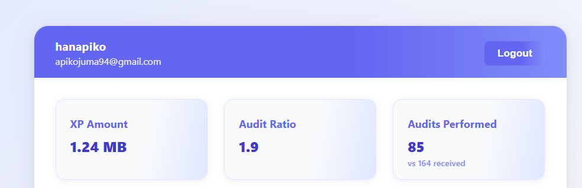

# GraphQL

A modern, responsive profile page built with vanilla JavaScript, HTML, and CSS, powered by the Zone01 GraphQL API. This project demonstrates authentication, querying, and SVG-based data visualization.

## Features

- **JWT Authentication**: Secure login using username/email and password.
- **Profile Display**: Shows user identification, XP, and audit ratio.
- **SVG Graphs**: Visualizes XP progress over time (line chart) and audits performed vs. received (pie chart).
- **Responsive Design**: Clean, modern UI that works on all devices.
- **Modular Code**: Organized JS modules for API, UI, authentication, and graphs.

## Demo


## Live Demo
🌐 **Live Site**: [View Live Demo](https://hanapiko.github.io/graphql/)

## Getting Started

### Prerequisites
- Modern web browser (Chrome, Firefox, Edge, Safari)
- Internet connection (to access the Zone01 API)

### Setup
1. **Clone or download this repository.**
git clone 
```bash
https://learn.zone01kisumu.ke/git/hanapiko/graphql.git
```
2. **Open `index.html` in your browser with liveserver.**
   - Or use a local server (recommended for module imports):
     ```bash
     npx http-server .
     # or
     python -m http.server 8000
     ```
3. **Login with your Zone01 credentials.**

## Usage
- **Login** with your username/email and password.
- **View your profile**: See your name, email, XP, and audit ratio.
- **Explore your journey**: Check out the XP progress line chart and project status pie chart.
- **Logout** using the button in the navbar.

## Project Structure
```
├── index.html
├── styles.css
├── README.md
└── js/
    ├── main.js
    ├── api.js
    ├── auth.js
    ├── ui.js
    └── graphs.js
```

## Customization
- **Styling**: Edit `styles.css` for colors, layout, or dark mode.
- **Graphs**: Modify or add new SVG graphs in `graphs.js`.
- **Data**: Adjust queries in `api.js` to fetch more or different data.

## Credits
- Built by hanapiko.
- Powered by the [Zone01 GraphQL API](https://learn.zone01kisumu.ke/api/graphql-engine/v1/graphql).

## Contribution
contributions are welcomed
